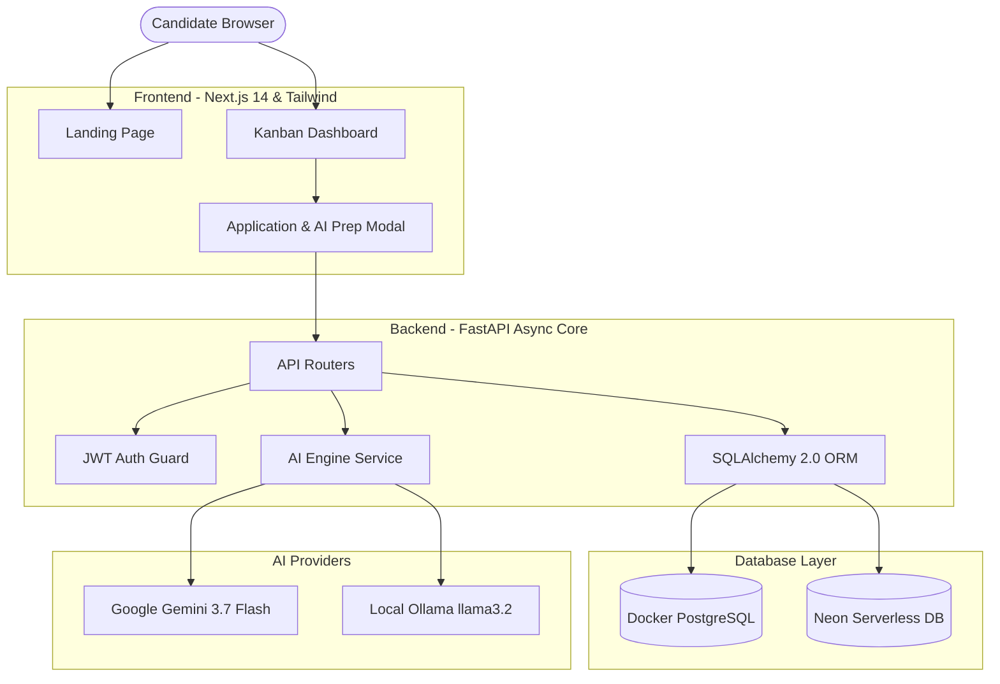

<div align="center">

# 🎯 TrackJob — Smart Job Tracker & AI Interview Prep

**An intelligent, full-stack application lifecycle & interview coaching platform for software engineers.**

[](https://github.com/adnanghani07/trackjob/actions)
[](https://fastapi.tiangolo.com)
[](https://nextjs.org)
[](https://www.postgresql.org)
[](https://tailwindcss.com)
[](https://opensource.org/licenses/MIT)

[Explore Features](#-features) • [System Architecture](#-system-architecture) • [Quickstart](#-quickstart-guide) • [API Specs](#-api-specification) • [Deployment](#-deployment)

</div>

---

## 🚀 Overview

**TrackJob** helps software developers organize company outreach, track multi-round technical interviews, log recruiter follow-ups, and leverage generative AI to automatically parse Job Descriptions into high-yield interview questions and tailored resume bullet points.

### ✨ Key Capabilities:
* **📊 Multi-Stage Kanban Pipeline**: Track applications across `Applied`, `Referral Outreach`, `Interviewing`, `Offers`, and `Rejections` with responsive search and source filtering.
* **👥 Network & Contact CRM**: Log recruiter emails, alumni referrers, and message outreach timelines with response tracking.
* **⏱️ Interview Round Timeline**: Schedule and record outcomes for Recruiter Screens, Live Coding, System Design, and Hiring Manager rounds.
* **🧠 Dual AI Coaching Engine**:
  * **Google Gemini 3.7 Flash**: Instant cloud question generation with structured JSON schema outputs (`response_mime_type="application/json"`).
  * **Local Ollama Fallback (`llama3.2:3b`)**: 100% offline, zero-cost, private inference running on your local GPU/CPU.
* **🛡️ Dual Database Strategy**:
  * **Local Docker PostgreSQL**: Offline zero-config development container.
  * **Neon Serverless PostgreSQL**: Production-grade connection pooling with automatic SSL mode (`sslmode=require`).
* **🔐 Stateless JWT Authentication**: Protected user-scoped data isolation with salted `bcrypt` password hashing.

---

## 🏛️ System Architecture



---

## ⚡ Quickstart Guide

### Prerequisites
* [Docker Desktop](https://www.docker.com/products/docker-desktop/)
* [Python 3.12+](https://www.python.org/)
* [Node.js 18+](https://nodejs.org/)
* [Ollama](https://ollama.com/) *(Optional: for local offline AI)*

### 1. Clone & Environment Setup
```bash
git clone https://github.com/adnanghani07/trackjob.git
cd trackjob
cp .env.example .env
```

### 2. Start PostgreSQL Container
```bash
docker compose up -d
```

### 3. Setup & Run Backend
```powershell
cd backend
python -m venv venv
.\venv\Scripts\Activate.ps1
pip install -r requirements.txt

# Run migrations
alembic upgrade head

# Seed demo data (Stripe, Google, OpenAI applications & prep notes)
python scripts/seed_data.py

# Start FastAPI server
uvicorn app.main:app --reload --port 8000
```
> *API Swagger Docs available at **`http://localhost:8000/docs`***

### 4. Setup & Run Frontend
```powershell
cd ../frontend
npm install
npm run dev
```
> *Open **`http://localhost:3000`** in your browser.*

---

## 🔑 Demo Account Credentials

| Attribute | Value |
| :--- | :--- |
| **Email** | `demo@interviewtracker.dev` |
| **Password** | `DemoPass123!` |

---

## 📖 API Specification

| Method | Endpoint | Description | Auth Required |
| :--- | :--- | :--- | :---: |
| `POST` | `/auth/register` | Register a new user account | No |
| `POST` | `/auth/login` | Authenticate & receive Bearer JWT | No |
| `GET` | `/auth/me` | Fetch authenticated user profile | Yes |
| `GET` | `/applications` | List user-scoped job applications | Yes |
| `POST` | `/applications` | Create a new job application | Yes |
| `PATCH` | `/applications/{id}` | Update application status or notes | Yes |
| `DELETE` | `/applications/{id}` | Cascade-delete application & notes | Yes |
| `POST` | `/applications/{id}/contacts` | Add recruiter / alumni contact | Yes |
| `POST` | `/contacts/{id}/outreach` | Log outreach message timestamp | Yes |
| `POST` | `/applications/{id}/interview-rounds` | Schedule technical interview round | Yes |
| `POST` | `/applications/{id}/ai/prep-notes` | Generate Gemini / Ollama prep notes | Yes |
| `GET` | `/applications/{id}/ai/prep-notes` | Get cached AI interview prep notes | Yes |

---

## 🧪 Running Tests

Execute the automated test suite covering authentication, cascade deletes, authorization guards, and AI prep generation:
```powershell
cd backend
pytest -v
```

---

## 🚢 Production Deployment

### Backend (Render / Fly.io)
1. Push your repository to GitHub.
2. Link your repo to [Render](https://render.com) using the blueprint manifest [`backend/render.yaml`](backend/render.yaml).
3. Provide your `DATABASE_URL` (Neon PostgreSQL) and optional `GEMINI_API_KEY`.

### Frontend (Vercel)
1. Import the `/frontend` directory to [Vercel](https://vercel.com).
2. Set Environment Variable `NEXT_PUBLIC_API_URL` to your live Render backend URL.
3. Deploy!

---

## 🤝 Contributing

Contributions, issues, and feature requests are welcome!
Please check our [Contributing Guidelines](CONTRIBUTING.md) and [Code of Conduct](CODE_OF_CONDUCT.md).

---

## 📄 License

Distributed under the **MIT License**. See [`LICENSE`](LICENSE) for more information.
